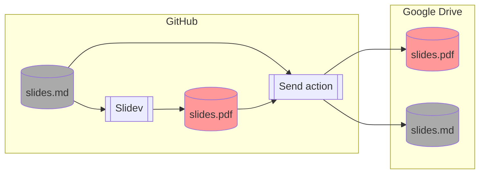

---
# try also 'default' to start simple
theme: default
# random image from a curated Unsplash collection by Anthony
# like them? see https://unsplash.com/collections/94734566/slidev
background: https://source.unsplash.com/collection/94734566/1920x1080
# apply any windi css classes to the current slide
class: "text-center"
# https://sli.dev/custom/highlighters.html
highlighter: shiki
# show line numbers in code blocks
lineNumbers: false
# some information about the slides, markdown enabled
info: TEst
# persist drawings in exports and build
drawings:
  persist: false
---

# テストのスライド

テストで作成しているスライド。

---

## 概要

- Slidev で作成しているスライド
- GitHub Actions から PDF 形式で Google Drive へデプロイ

